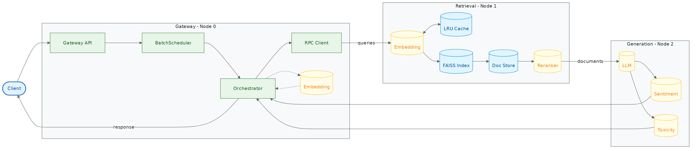

# Distributed ML Inference Pipeline

A three node, memory constrained retrieval augmented generation serving system built for Cornell CS 5416, Cloud Computing and ML Hosting. The project refactors a monolithic machine learning workload into configurable FastAPI services and uses profiling driven experiments to study the tradeoffs among throughput, latency, model placement, batching, memory use, and network overhead.

The pipeline performs query embedding, FAISS retrieval, document loading, reranking, language model generation, sentiment analysis, and toxicity filtering. Its runtime can distribute these stages across three nodes without changing application code.

## Highlights

- Configurable three node microservice architecture using FastAPI and asynchronous HTTP communication
- Adaptive and fixed batching for gateway, retrieval, and generation workloads
- GPU execution through CUDA and Apple MPS, with CPU execution supported for reproducible experiments
- Configurable placement of embedding, retrieval, reranking, generation, and postprocessing components
- Caching, compact serialization, LZ4 compression, and document identifier only transfer modes
- Prometheus, Grafana, OpenTelemetry, Scalene, and process level performance instrumentation
- Reproducible YAML experiment manifests with automated latency, throughput, queue depth, success rate, and memory analysis

## Architecture



A typical request follows this path:

1. The gateway validates the client request and forms batches.
2. The retrieval service embeds the query, searches a FAISS index, loads documents, and optionally reranks them.
3. The generation service runs the language model and the sentiment and toxicity classifiers.
4. The gateway assembles the structured response and returns it to the client.

Profiles in `configs/` can move individual stages between nodes so different system designs can be evaluated without rewriting the service implementation.

## Performance Results

The final course experiments compared multiple service placements, batching policies, concurrency levels, and payload modes.

| Configuration | Throughput | Median latency | P95 latency |
| --- | ---: | ---: | ---: |
| Baseline reference | About 46.5 requests per minute | Under 1 second | About 2.6 seconds |
| Optimized batch size four | About 67.5 requests per minute | About 3.3 seconds | About 6.8 seconds |
| Retrieval with reranking experiments | About 75 to 135 requests per minute | Workload dependent | Workload dependent |

The optimized batch size four configuration improved throughput by approximately 45 percent relative to the baseline. The higher throughput retrieval with reranking configurations showed that moving CPU intensive reranking away from the generation node allowed the language model service to focus on generation.

These measurements were collected in a course environment and depend on the workload, hardware, concurrency, and model configuration. They are most useful as controlled comparisons among system designs rather than universal production benchmarks.

## My Contributions

This was a four person Cornell project. My primary contributions included:

- Implementing the modular multi node runtime and the configuration driven profiling and experiment system
- Adding multithreading, adaptive batching, caching, faster serialization, compressed payload transfer, and GPU support
- Building performance instrumentation and experiment automation using Prometheus, Grafana, Scalene, structured metrics, and YAML manifests
- Running system experiments, analyzing throughput and tail latency tradeoffs, improving test coverage, and coauthoring the final report

## Technology Stack

| Area | Technologies |
| --- | --- |
| Model serving and retrieval | PyTorch, Hugging Face Transformers, Sentence Transformers, FAISS |
| Services and communication | FastAPI, Uvicorn, HTTPX, Pydantic, msgspec |
| Performance | asyncio, adaptive batching, caching, LZ4, Zstandard, orjson, memory mapped data |
| Observability | Prometheus, Grafana, OpenTelemetry, Scalene, psutil |
| Development and infrastructure | Python, Linux, Docker Compose, uv, pytest, Ruff, mypy, GitHub Actions |

## Repository Layout

```text
configs/                 Node profiles and experiment manifests
monitoring/              Prometheus and Grafana configuration
report/                  Architecture diagram and final technical report
scripts/                 Workload, profiling, experiment, and analysis tools
src/pipeline/            Components, services, orchestration, telemetry, and runtime code
tests/                   Unit and integration tests
```

## Quick Start

### Requirements

- Python 3.10.12 or newer
- `uv`
- Docker or Podman with Compose support for the monitoring stack

### Install Dependencies

Install `uv` with Homebrew:

```bash
brew install uv
```

or with the official installer:

```bash
curl -LsSf https://astral.sh/uv/install.sh | sh
```

Create the environment and install dependencies:

```bash
uv venv
uv sync --all-groups
source .venv/bin/activate
```

Optional Git hooks can be installed with `prek`:

```bash
brew install prek
prek install
```

or:

```bash
uv tool install prek
prek install
```

Run all hooks with:

```bash
prek run --all-files
```

## Run the Pipeline

Generate the test documents:

```bash
python scripts/create_test_docs.py
```

Start the three node pipeline:

```bash
./start_pipeline.sh
```

In another terminal, run the client:

```bash
python scripts/client.py
```

## Monitoring

Start the monitoring stack:

```bash
docker compose -f monitoring/docker-compose.yml up
```

Open Grafana at `http://localhost:3000`.

The services expose metrics for request counts, stage latency, queue depth, batch size, cache activity, compression, process memory, and other runtime behavior.

## Modular Profiling and Experiments

### Add a Profile

Create a YAML file such as `my_profile.yaml`:

```yaml
name: my_custom_profile
description: Custom profile description
batch_size: 32
batch_timeout: 0.1
components:
  - name: orchestrator
    type: gateway
    config:
      retrieval_url: http://localhost:8001
routes:
  - target: gateway
    prefix: /
```

### Run One Experiment

```bash
python scripts/run_experiment.py configs/experiments/baseline.yaml
```

The experiment driver:

1. Loads the experiment manifest.
2. Starts the monitoring stack when needed.
3. Starts the nodes with the selected profiles.
4. Runs the configured workload.
5. Collects request metrics and process statistics.
6. Stores artifacts under `artifacts/experiments/<run_id>_<timestamp>/`.

### Run the Experiment Suite

```bash
./scripts/run_all_experiments.sh
```

### Analyze Results

```bash
python scripts/analyze_experiments.py
```

Aggregated tables and plots are written to the analysis output directories associated with the experiment data.

## Important Configuration

`DOCUMENTS_PAYLOAD_MODE` controls how documents are passed between services:

- `full` sends complete document content.
- `id_only` sends document identifiers and requires a document store on the receiving service.
- `compressed` sends compressed document payloads.

Other important controls include:

- `ENABLE_ADAPTIVE_BATCHING`
- `GATEWAY_BATCH_SIZE`
- `GATEWAY_BATCH_TIMEOUT_MS`
- `RETRIEVAL_BATCH_SIZE`
- `GENERATION_BATCH_SIZE`
- `CPU_INFERENCE_THREADS`
- `CPU_WORKER_THREADS`
- `MAX_PARALLEL_GENERATION`
- `DISABLE_CACHE_FOR_PROFILING`

Caching is normally disabled during controlled profiling so repeated requests do not distort comparisons. To profile with caching enabled, set `DISABLE_CACHE_FOR_PROFILING=False` and use either randomized queries or the cache clearing option:

```bash
python scripts/profile_pipeline.py --randomize-queries
```

## Project Team

- Kadambari Mirashi
- Ian Holloway
- Sanjeev Ragunathan
- Rachel Yan
